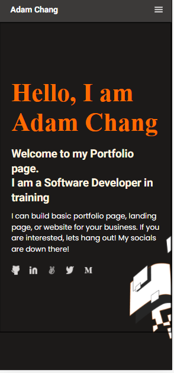

# Hello-Portfolio

> In this project, I will set up a "Hello-Portfolio" repository. My goal here is to create the first page of a mobile-friendly portfolio page. 

## Built With

- Html
- CSS
- No Frameworks used
- No Technologies used

## Live Demo

## Getting Started

**This is an example of how you may give instructions on setting up your project locally.**
**Modify this file to match your project, remove sections that don't apply. For example: delete the testing section if the currect project doesn't require testing.**

To get a local copy up and running follow these simple example steps.

### Setup
Clone repository

## Authors

👤 **You-Wei (Adam) Chang**

- GitHub: [@adamteddychang](https://github.com/adamteddychang)
- Twitter: [@AdamChang3](https://twitter.com/AdamChang3)
- LinkedIn: [LinkedIn](https://linkedin.com/in/linkedinhandle)

👤 

## 🤝 Contributing

Contributions, issues, and feature requests are welcome!

Feel free to check the [issues page](../../issues/).

## Show your support

Give a ⭐️ if you like this project!

## Acknowledgments

- Hat tip to anyone whose code was used
- Inspiration
- etc

## 📝 License

This project is MIT licensed.